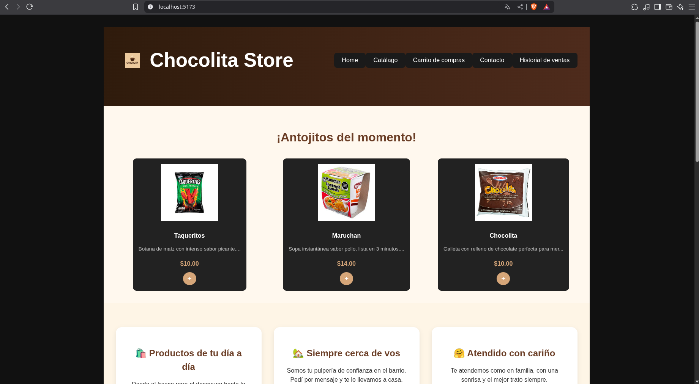
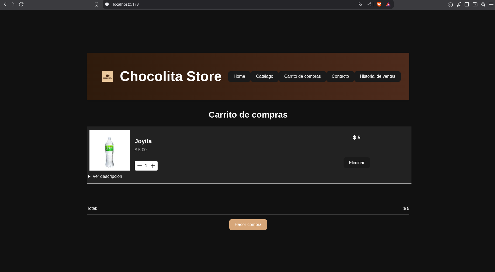
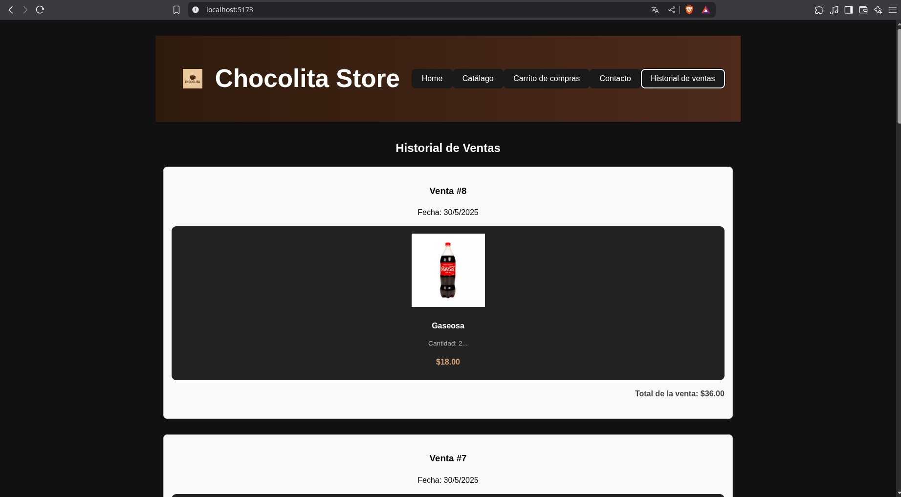

# Chocolita Store

**_Idioma_**

- 🇪🇸 Español
- [🇺🇸 Ingles](./README.md)

## 🧠 Sobre el proyecto

Una aplicación web de una pulpería ficticia que vende una variedad de productos.

## 📷 Capturas de pantalla





## 🚀 Funcionalidades

- Obtener el catálogo de productos.
- Agregar productos al carrito de compras.
- Realizar pedidos.
- Ver el historial de compras.
- Página de inicio y contacto.

_Nota: Algunas de estas funcionalidades interactúan directamente con el backend._

## 🔧 Instalación

Instala las dependencias

```sh
npm install
```

Inicia el proyecto en modo desarrollo

```sh
npm run dev
```

## 🛠️Tecnologías

- React + Vite

## 📓 Librerías

- [sonner](https://github.com/emilkowalski/sonner)
- [React Router](https://github.com/remix-run/react-router)

## 🖼️Estilos

### Iconos

- [tabler](https://tabler.io/icons)

### Fuentes

- [Segoe UI](https://learn.microsoft.com/en-us/typography/font-list/segoe-ui)
