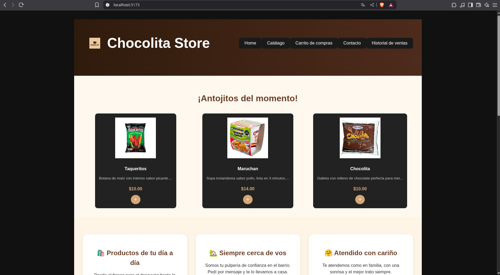

# Chocolita Store

A web app for a fictional pulpería that sells a variety of everyday products.

## 📷 Screenshots




## 🚀 Features

- Retrieve the product catalog.
- Add items to the shopping cart.
- Place orders.
- View purchase history.
- Home page and contact.

_Note: Some of these features interact directly with the backend._

## 🔧 Installation

Install the dependencies

```sh
npm install
```

Start the project in development mode

```sh
npm run dev
```

## 🛠️Tech Stack

- React + Vite

## 📓 Libraries

- [sonner](https://github.com/emilkowalski/sonner)
- [React Router](https://github.com/remix-run/react-router)

## 🖼️Styles

### Icons

- [tabler](https://tabler.io/icons)

## Fonts

- [Segoe UI](https://learn.microsoft.com/en-us/typography/font-list/segoe-ui)
