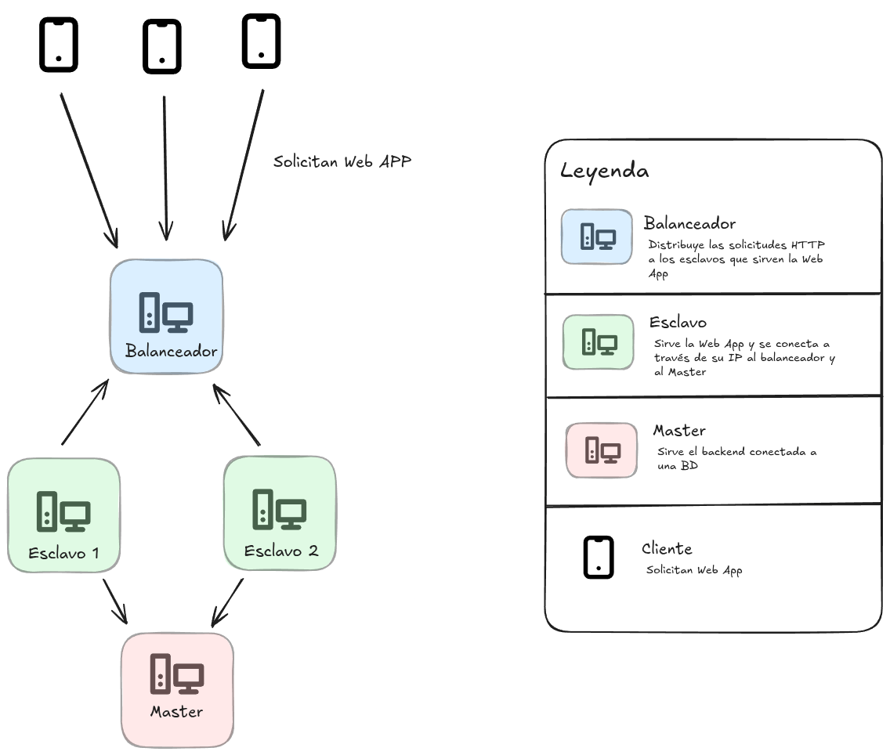

# Chocolita Store

**_Idioma_**

- 🇪🇸 Español
- [🇺🇸 Ingles](./README.md)

## 🧠 Sobre el proyecto

Una implementación de arquitectura en clúster conformada por 4 nodos. El objetivo es servir una página web llamada [Chocolita Store](./Client/README.es.md), conectada a un [backend](./Server/) y utilizando [Nginx](https://nginx.org/) como servidor web/proxy.

## 🏛️ Arquitectura



La idea es que existe un balanceador de carga que se encarga de distribuir las peticiones de los clientes entre los nodos esclavos, los cuales sirven la página web. Además, hay un nodo máster que se encarga de ejecutar el backend, ofreciendo una REST API que los nodos esclavos consumen.

Todos los nodos utilizan [Fedora](https://fedoraproject.org/es/) como sistema operativo.

### Estructura de carpetas

- [`Client`](./Client/): Contiene la página web (frontend).
- [`Scripts`](./Scripts/): Incluye los archivos de configuración de Nginx y los scripts de instalación.
- [`Server`](./Server/): Contiene la aplicación del backend.

## 🧾 Finalidad

Este proyecto ha sido desarrollado con fines didácticos, sin ningún propósito de lucro.

## ⚙️ Puesta en marcha

Para iniciar el proyecto, se asume que el sistema operativo es Fedora o una distribución derivada. A continuación, se detallan los pasos para configurar cada nodo.

### Nodo Maestro

<details>

1.  Instala MySQL. Habilita e inicia el servicio. Puedes seguir la [guía oficial de Fedora](https://docs.fedoraproject.org/en-US/quick-docs/installing-mysql-mariadb/).
2.  Crea la base de datos utilizando el script [`db.sql`](./Server/db.sql).
3.  Ejecuta el script [`master.sh`](./Scripts/master.sh).

    ```sh
    chmod +x master.sh # Otorga permisos de ejecución
    ./master.sh
    ```

</details>

### Nodo Esclavo

<details>

1.  En el archivo [`config.js`](./Client/src/config.js), añade la URL de la API REST (proporcionada por el nodo maestro) en la constante `API_URL`.

    ```js
    export const API_URL = "http://localhost:3000/api";
    ```

    Para obtener la URL de la REST API, simplemente necesitas la dirección IP del nodo maestro. Por ejemplo: `http://192.168.50.10/api`.

2.  Ejecuta el script [`slave.sh`](./Scripts/slave.sh).

    ```sh
    chmod +x slave.sh # Otorga permisos de ejecución
    ./slave.sh
    ```

</details>

### Balanceador de carga

<details>

1.  En el script [`load-balancer.sh`](./Scripts/load-balancer.sh), agrega las direcciones IP de los nodos esclavos dentro del bloque `upstream backend`.

2.  Ejecuta el script [`load-balancer.sh`](./Scripts/load-balancer.sh).

    ```sh
    chmod +x load-balancer.sh # Otorga permisos de ejecución
    ./load-balancer.sh
    ```

</details>

<p align="center">
    <b> </b>
</p>

> **Nota:** Para que los nodos puedan comunicarse entre sí, es necesario configurar el firewall. Consulta la [guía oficial de Fedora](https://docs.fedoraproject.org/en-US/quick-docs/firewalld/).

## 👥 Contribuidores

- [Isabel Denisse Aguilar Vilchez](https://github.com/denisseaguilar)
- [Maria Alessandra Mejía Navarro](https://github.com/Marialess)
- [Francisco de Jesus Melendez Simplina](https://github.com/FranciscoMelen10)
- [Osmar Adrian Mora Cerna](https://github.com/osmarmora05)
- [Abigail Rocha](https://github.com/abigawwl)

## ⚖️ License

GNU General Public License version 3
