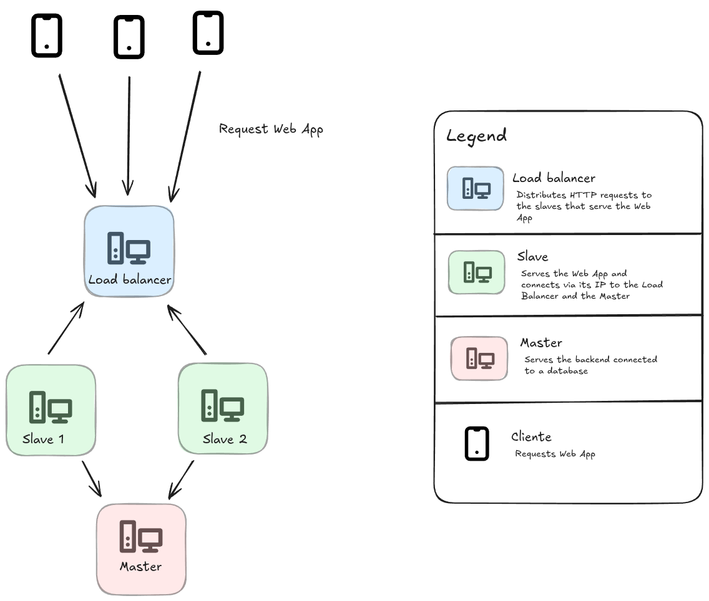

# Chocolita Store

**_Language_**

- [🇪🇸 Spanish](./README.es.md)
- 🇺🇸 English

## 🧠 About the project

An implementation of a cluster architecture composed of 4 nodes. The goal is to serve a web page called [Chocolita Store](./Client/README.es.md), connected to a [backend](./Server/) and using [Nginx](https://nginx.org/) as a web server/proxy.

## 🏛️ Architecture



The idea is that a load balancer is responsible for distributing client requests among the slave nodes, which serve the web page. Additionally, there is a master node that runs the backend, providing a REST API that the slave nodes consume.

All nodes use [Fedora](https://fedoraproject.org/) as their operating system.

### Folder Structure

- [`Client`](./Client/): Contains the web page (frontend).
- [`Scripts`](./Scripts/): Includes Nginx configuration files and installation scripts.
- [`Server`](./Server/): Contains the backend application.

## 🧾 Purpose

This project has been developed for educational purposes, with no intention of monetization.

## ⚙️ Getting Started

To get the project up and running, it is assumed that the operating system is Fedora or a Fedora-based distribution. Below are the steps to configure each node.

### Master Node

<details>

1.  Install MySQL. Enable and start its service. You can follow the [official Fedora guide](https://docs.fedoraproject.org/en-US/quick-docs/installing-mysql-mariadb/).
2.  Create the database using the [`db.sql`](./Server/db.sql) script.
3.  Execute the [`master.sh`](./Scripts/master.sh) script.

    ```sh
    chmod +x master.sh # Grant execution permissions
    ./master.sh
    ```

</details>

### Slave Node

<details>

1.  In the [`config.js`](./Client/src/config.js) file, add the REST API URL (provided by the master node) to the `API_URL` constant.

    ```js
    export const API_URL = "http://localhost:3000/api";
    ```

    To get the REST API URL, you just need the IP address of the master node. For example: `http://192.168.50.10/api`.

2.  Execute the [`slave.sh`](./Scripts/slave.sh) script.

    ```sh
    chmod +x slave.sh # Grant execution permissions
    ./slave.sh
    ```

</details>

### Load Balancer

<details>

1.  In the [`load-balancer.sh`](./Scripts/load-balancer.sh) script, add the IP addresses of the slave nodes inside the `upstream backend` block.

2.  Execute the [`load-balancer.sh`](./Scripts/load-balancer.sh) script.

    ```sh
    chmod +x load-balancer.sh # Grant execution permissions
    ./load-balancer.sh
    ```

</details>

<p align="center">
    <b> </b>
</p>

> **Note:** For the nodes to be able to communicate with each other, it is necessary to configure the firewall. See the [official Fedora guide](https://docs.fedoraproject.org/en-US/quick-docs/firewalld/).

## 👥 Contributors

- [Isabel Denisse Aguilar Vilchez](https://github.com/denisseaguilar)
- [Maria Alessandra Mejía Navarro](https://github.com/Marialess)
- [Francisco de Jesus Melendez Simplina](https://github.com/FranciscoMelen10)
- [Osmar Adrian Mora Cerna](https://github.com/osmarmora05)
- [Abigail Rocha](https://github.com/abigawwl)

## ⚖️ License

GNU General Public License version 3
